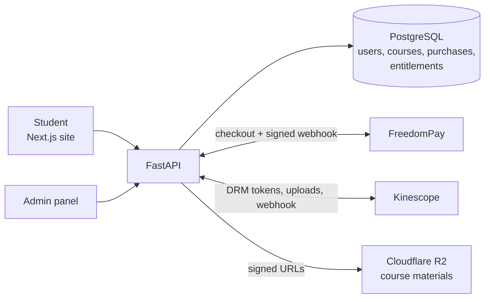
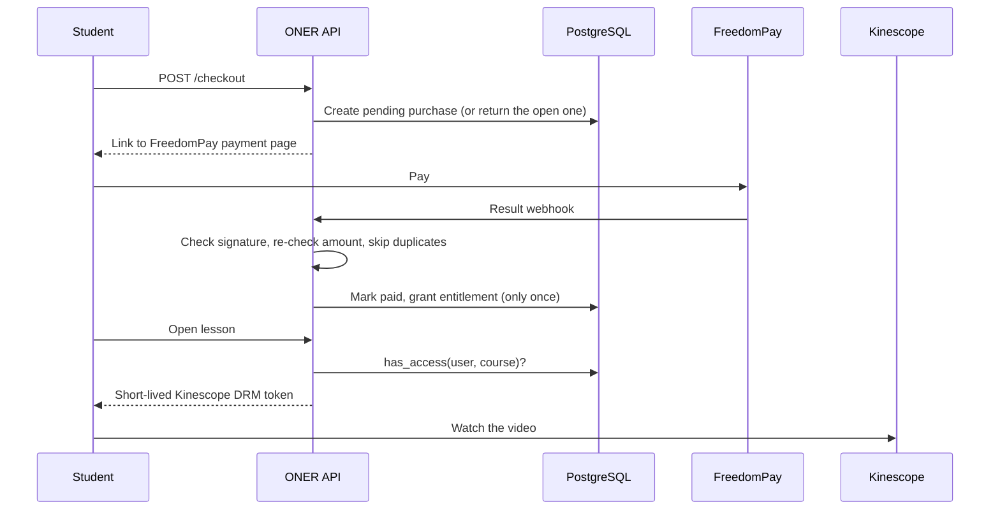

# ONER

Backend for ONER, an online filmmaking course platform for Russian speaking Central Asia (Kyrgyzstan, Kazakhstan, Uzbekistan).
I built the backend with FastAPI, PostgreSQL, SQLModel and Alembic. The Next.js frontend is in `web/`.

<p align="center">
  
</p>

> This public repo starts from a snapshot of the code. The day by day development history is in a private repo.

The whole product is one rule: **you watch a lesson only if you own it.**
Access is decided on the server from an `entitlements` table. Never by the client, never on a payment redirect, only after a verified payment webhook.

## Why I built it this way

The risky part of a paid course app is not the UI. It is making sure one payment gives access exactly once, and that a video can not be stolen by sharing a link.
So I built the backend first, test first, and locked down the buy, own, watch flow before any frontend existed.

## Architecture



## Buy, own, watch



## Admin panel

Everything a student sees is made in the admin panel. It is the only way to write content, and every admin route checks the role on the server.

- **Courses**: create a course with "What you'll learn" and "Requirements", then modules and lessons inside it. Drafts stay hidden until they are published. A course that someone already bought can not be deleted.
- **Video**: upload a lesson video straight from the browser to Kinescope. The old video stays live until Kinescope finishes processing the new one, then it is swapped in. Videos that no lesson uses are deleted.
- **Materials**: files upload straight from the browser to Cloudflare R2 with a signed upload URL, so big files never go through the API. A storage sweep removes uploads that nothing points to.
- **Accounts**: find a user by email, and see every course they own and every payment they tried. Change their role, set a new password, or disable the account.
- **Purchases**: full payment history, with filters by email, course and status. Pending rows are abandoned checkouts.
- **Refunds**: the money goes back in FreedomPay's merchant cabinet. Then the admin records the refund here and decides if the course is taken away too.
- **Manual access**: give someone a course, or take it away. Giving the same course twice is safe, it returns the same entitlement.

## Quickstart

```bash
# 1. deps (uses uv)
uv sync

# 2. env
cp .env.example .env   # fill in secrets

# 3. start Postgres (docker compose) and apply the schema
docker compose up -d db
uv run alembic upgrade head     # create tables
uv run python -m app.seed       # optional: sample courses

# 4. run the API
docker compose up --build       # full stack on http://localhost:8000
# or just the API against your own Postgres:
uv run uvicorn app.main:app --reload
```

### Kinescope DRM (one-time, per project)

Register the playback authorization endpoint so Kinescope knows where to ask:

```bash
curl -X PUT https://api.kinescope.io/v1/drm/auth/$KINESCOPE_PROJECT_ID \
  -H "Authorization: Bearer $KINESCOPE_API_KEY" \
  -H "Content-Type: application/json" \
  -d '{"url": "https://<your-host>/drm/auth", "username": "...", "password": "..."}'
```

The username/password are optional Basic Auth and must match `KINESCOPE_DRM_AUTH_*`.

Then register the status webhook, so a finished upload swaps into its lesson on its own:

```bash
curl -X POST https://api.kinescope.io/v1/webhooks \
  -H "Authorization: Bearer $KINESCOPE_API_KEY" \
  -H "Content-Type: application/json" \
  -d '{"name": "oner", "endpoint": "https://<your-host>/webhooks/kinescope", "events": ["media.update.status"], "login": "...", "password": "..."}'
```

The login/password must match `KINESCOPE_WEBHOOK_*`; the route stays closed until they're set. Without the webhook, `GET /admin/lessons/{id}/video` does the same check on demand.

### Uploading a lesson video

1. `POST /admin/lessons/{id}/video/upload` with `filename` and `filesize` returns a Tus `endpoint`.
2. The admin page uploads the file there with [tus-js-client](https://github.com/tus/tus-js-client). The endpoint takes no token; the API key never reaches the browser.
3. `GET /admin/lessons/{id}/video` reports Kinescope's status and swaps the video in once it's `done`. Students keep the old video until then.

For an upload widget: the browser's own progress comes from tus-js-client's `onProgress`, since the bytes never pass through the API. After the upload finishes, poll step 3 and show its `state`: `in_progress`, `complete` or `failed` (Kinescope's `error`, `aborted`, `suspended`, or the video gone). A failed upload leaves the old video playing; upload again or `DELETE /admin/lessons/{id}/video/pending`.

### Behind a proxy

Railway and DO put a proxy in front of the container. Set `FORWARDED_ALLOW_IPS` so uvicorn trusts its `X-Forwarded-For`. Without it every request appears to come from the proxy, and each rate limit turns into one bucket shared by every user. On Vercel there's no uvicorn to configure; set `TRUSTED_IP_HEADER=x-vercel-forwarded-for` instead.

Outside `ENVIRONMENT=development` the app refuses to start without a `JWT_SECRET` of at least 32 characters.

### R2 bucket CORS

Admin uploads PUT straight from the browser to R2, so the bucket needs its own CORS rule allowing `PUT` from the admin page's origin. `CORS_ORIGINS` doesn't cover it; that request never touches the API.

### Sweeping R2

Files no material points at (an upload the admin never recorded, or a delete whose R2 call failed) cost storage until they're removed. Run the sweep on a schedule, e.g. a daily Railway cron:

```bash
uv run python -m app.sweep           # list orphans
uv run python -m app.sweep --apply   # delete them
```

Files younger than `MATERIAL_ORPHAN_GRACE_H` (24h) are skipped so an upload in progress is never swept. Admins can run the same thing from `POST /admin/storage/sweep`, a dry run unless `apply=true`.

Health check: `GET http://localhost:8000/health` → `{"status": "ok"}`
Interactive docs: `http://localhost:8000/docs`

## Test

```bash
uv run pytest                       # full suite
uv run pytest --cov=app             # with coverage
```

Tests mock all external services (FreedomPay, Kinescope, R2), CI never hits a real API. GitHub Actions runs the suite on every push.

## How it works

- **Auth**: roll-your-own JWT (OAuth2 password flow, argon2 hashing).
- **Catalog**: public browses published courses; drafts stay admin-only. Unpublishing hides a course from the catalog and checkout, but its owners keep access.
- **Entitlements**: the access core. `has_access(user, course)` gates every lesson, video token, and material download.
- **Payments**: `POST /checkout` builds a FreedomPay hosted-page link; a signature-verified, idempotent webhook is the *only* thing that grants access. A second payment for something already paid is rejected when FreedomPay allows it, and logged for a manual refund when it doesn't. `GET /me/purchases/{id}` tells the checkout return page how the payment ended.
- **Video**: owners get a short-lived Kinescope DRM token; non-owners get 403. Admins upload straight from the browser to Kinescope; a new video replaces the old one only once Kinescope has finished processing it, and videos no lesson uses are deleted.
- **Materials**: time-limited R2 signed URLs, gated by ownership. Titles are listed on the course page; the files are not.
- **Admin**: the only write path for content: courses with "What you'll learn" and "Requirements", modules and lessons with descriptions, and material uploads that PUT straight to R2. A purchased course can't be deleted. Admins also find accounts by email, see what an account bought, and change its role, set its password, or disable it. A refund is made in FreedomPay's merchant cabinet and recorded with `POST /admin/purchases/{id}/refund`, where the admin decides whether the course goes too; `DELETE /admin/entitlements` takes a course away on its own.
- **Storage**: deleting content deletes its R2 files; a sweep removes uploads no material points at.
- **Ops**: JSON logs on stdout, one line per request, every line tagged with its `X-Request-ID`. CORS allows only `CORS_ORIGINS`.

## Stack

FastAPI · SQLModel · Alembic · Postgres · pydantic-settings · pytest + httpx · Docker Compose · GitHub Actions

## Status

Built day by day, test first.

- [x] **Day 1**: skeleton, `/health`, pytest, CI green
- [x] **Day 2**: 8-table schema, Alembic migration, seed script, model tests
- [x] **Day 3**: JWT auth (register/login/refresh/me), argon2, role gate, login rate-limit
- [x] **Day 4**: catalog API (published-only public, drafts admin-only, video id never in browse)
- [x] **Day 5**: entitlements: `has_access`/`grant` (idempotent), `/me/courses`, gated lesson detail, admin manual grant
- [x] **Day 6**: checkout: `POST /checkout` creates a pending purchase and a FreedomPay payment link (signed, sandbox)
- [x] **Day 7**: FreedomPay result webhook: verified signature, re-checked amount, dedupe → grants access exactly once
- [x] **Day 8**: Kinescope DRM: owner-only `drmauthtoken`, playback authorization callback, full buy→watch journey test
- [x] **Day 9**: materials: ownership-gated R2 signed URLs, 60-second expiry, filename from the title
- [ ] **Day 10**: admin authoring done (courses, modules, lessons, material uploads, price audit); deploy still to do
- [x] **Day 11**: hardening: test DB enforces foreign keys, null-safe PATCH, one JSON error shape, CORS from config, register rate limit, JSON request logs
- [x] **Day 12**: course page structure (what you'll learn, requirements, module and lesson descriptions, material titles), account admin (search, purchases, role, password, disable), R2 cleanup on delete plus an orphan sweep
- [x] **Day 13**: lesson video uploads straight to Kinescope over Tus, swapped in only once processed, status webhook, unused videos deleted from Kinescope
- [x] **Day 14**: refunds and access revoke; upload widget state; launch fixes: owners keep unpublished courses, case-insensitive email, UTC timestamps, Cyrillic download names, one open order per price, duplicate payments rejected, JWT secret guard, trusted client IP header.
